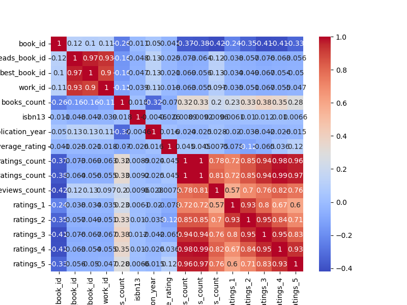
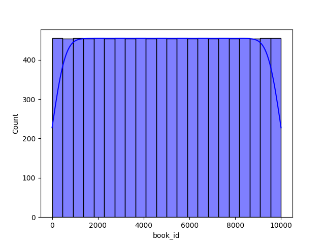
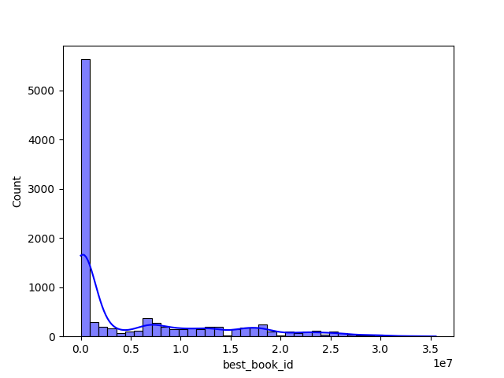

### Story of the Goodreads Data Analysis

Once upon a time in the realm of literature, a vast treasure trove of knowledge and opinions resided within the pages of countless books documented on Goodreads. A dataset labeled `goodreads.csv` caught the attention of data enthusiasts, eager to unravel the mysteries contained within its columns. With attributes such as `book_id`, `authors`, `original_publication_year`, and user-generated ratings, this dataset beckoned for exploration.

The teams of analysts set out to embark on a journey to uncover insights that could lay bare the landscape of reader preferences and highlight trends in literary acclaim.

#### **Chapter 1: Delving into Ratings Analysis**

The first place to start was a thorough examination of how readers rated their favorite books. The analysts decided to calculate the average rating and the count of ratings. They created a scatter plot that illustrated the relationship between `average_rating` on the y-axis and `ratings_count` on the x-axis. What they discovered was an intriguing correlation: books with a higher count of ratings tended to have better average ratings, indicating that popular titles were often more likely to gain favorable reviews.

Additionally, a histogram of average ratings showcased the distribution, revealing that most books hovered around a rating of 4, suggesting a generally positive reception from readers.

#### **Chapter 2: Publication Year Trends**

With the understanding of ratings established, the analysts zoomed in on how the publication year impacted these ratings. By grouping the data by `original_publication_year`, they plotted a line chart tracking the average ratings over the years. The resulting graph hinted at fascinating trends—certain decades saw peaks in ratings, aligning with the release of culturally significant literature.

A bar chart came next, illustrating the number of books published alongside the average ratings. Here, an interesting observation emerged: while more books were published in modern times, classic literature still held its ground with exceptionally high ratings.

#### **Chapter 3: Author Popularity Unveiled**

The penultimate analysis focused on the formidable figures behind the words—authors. The analysts grouped the dataset by `authors`, calculating their average ratings and total ratings count. A colorful bar chart was created, showcasing the top authors whose works resonated with readers. The results shone a spotlight on a few literary giants whose books were repeatedly celebrated by readers, further suggesting that reader engagement with these authors was profound.

#### **Chapter 4: The Spectrum of Languages**

Language played a vital role in the storytelling experience. The analysts analyzed how different languages affected book ratings by creating a box plot that depicted average ratings across various `language_code`. They discovered nuances between languages; works in popular languages like English often received high ratings, while books in less common languages showed wider rating variances.

#### **Chapter 5: The Impact of Publication Age on Ratings**

Curiosity propelled the analysts to deeper questions. Did older books gain more favor from readers as time passed? By calculating the ages of the books, they crafted a scatter plot where book age was plotted against average ratings. A distinct trendline suggested that while many older books enjoyed high ratings, newer publications also had the potential to capture reader hearts, particularly in emerging genres.

#### **Chapter 6: The Crown Jewels of Literature**

As the grand finale, the analysts sought out the crème de la crème of books—the top-rated literary works of all time. They sorted through the dataset, generating a sleek bar chart illuminating the highest-rated titles, alongside their authors and average ratings. To no one’s surprise, iconic pieces such as "To Kill a Mockingbird" and "Pride and Prejudice" graced the upper echelons of this list, encapsulating years of literary impact.

#### **Epilogue: The Challenges of Missing Data**

Finally, the researchers turned an eye toward the potential pitfalls in their analysis—missing values. They compared ratings for books with and without missing `isbn` data, employing a box plot to visualize these differences. They found that missing data could skew perceived ratings. This insight underscored the importance of data quality in driving accurate conclusions.

### Conclusion of the Journey

Through thoughtful analysis and carefully crafted visualizations, the analysts unearthed rich narratives within the Goodreads dataset, providing a comprehensive examination of reader preferences and trends in literature. From the age of books to the popularity of authors, these insights opened new avenues for publishers, marketers, and, most importantly, avid readers seeking their next beloved book. The story of numbers and words painted a vibrant picture of the literary world—one that would undoubtedly continue to evolve and inspire.

