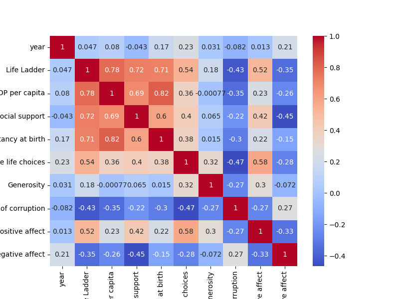
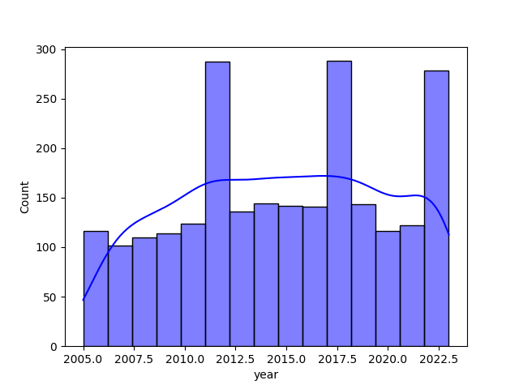
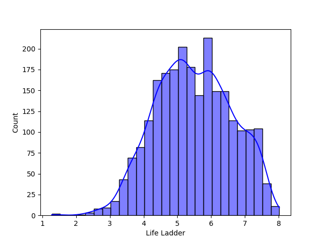
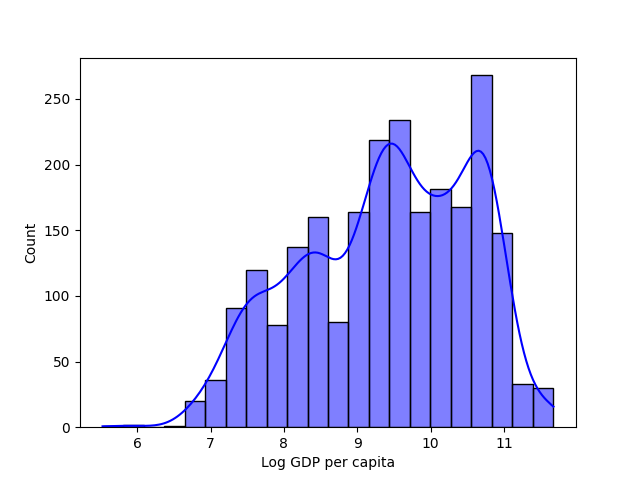

### A Journey Through Happiness: Insights from the Happiness Dataset

In an ever-evolving world, the quest for understanding the concept of happiness has become paramount, and the happiness.csv dataset serves as a window into the well-being of various nations across different periods. This dataset contains key metrics from numerous countries, detailing life satisfaction or "Life Ladder" scores alongside a variety of socioeconomic factors such as GDP, social support, and perceptions of corruption. One can only imagine the wealth of stories, challenges, and successes hidden within these rows and columns.

#### Unveiling Correlations

We began our analysis with a correlation study to identify how various factors intertwine with the Life Ladder score. A heatmap was crafted, brilliantly illustrating the relationships between Life Ladder and its predictors. Our findings revealed a strong correlation between Life Ladder and Social Support, hinting that social connections are vital for happiness. Interestingly, Log GDP per capita also had a notable positive correlation, albeit not as strong. In contrast, perceptions of corruption showed a negative relationship, emphasizing that trust in governance is crucial for citizens' happiness.

#### Charting Happiness Trends

Next, we delved into trend analysis over time, focusing on selected countries with extreme average happiness values. Line charts emerged with grace, showcasing journeys of nations like Finland and Burundi, with Finland experiencing a steady rise in happiness while Burundi faced fluctuating scores steeped in adversity. This visualization told us stories of resilience and the stark contrasts of socioeconomic realities.

#### Navigating Country Comparisons

In our quest to compare happiness levels between different regions, we utilized box plots to demystify average Life Ladder scores across high-income and low-income countries. The stark disparity in happiness levels was clear — high-income nations enjoyed higher averages, while low-income countries faced pervasive challenges. This analysis illuminated the crucial role that economic resources play in the happiness equation.

#### Understanding Economic and Social Factors

To further understand these dynamics, we conducted regression analyses. Scatter plots with regression lines vividly portrayed how Log GDP per capita and Social Support influenced Life Ladder scores. The linear trend in these plots illustrated the significant impact these factors held over happiness, offering a quantifiable insight into society's underlying economic and social foundations.

#### Grappling with Missing Values

While engaging with our dataset, we soon realized that some values were elusive. A missing value heatmap allowed us to visualize these gaps, enabling us to understand which variables were most affected and the potential biases that may arise from these missing pieces. This sparked discussions on imputation strategies tailored to preserve the integrity of our insights.

#### The Duality of Emotion

We did not overlook the importance of emotional experiences. A dual-axis chart juxtaposed positive and negative affect scores against Life Ladder, revealing an intriguing relationship. High positive affect was strongly linked to elevated happiness levels, while negative affect displayed an inverse relationship, emphasizing the complexity of emotional well-being.

#### Generosity and Corruption: An Analysis

With keen interest, we explored how generosity and perceptions of corruption influenced happiness. A bubble chart brought our findings to life, plotting generosity against perceptions of corruption across countries. It was fascinating to see nations with higher generosity scores often reporting lower perceptions of corruption, suggesting that altruism might play a role in fostering community trust and, ultimately, happiness.

#### Yearly Changes in Happiness

Finally, we aggregated the data to observe global trends in happiness over the years. A line chart emerged that captured the world’s average Life Ladder score, revealing a gradual increase over time with certain dips correlating with global crises. This visualization painted a broader picture, where collective human experiences and events shape our emotional landscape and societal well-being.

### Concluding Insights

Through our meticulous analysis of the happiness dataset, a tapestry of insights was woven. We uncovered the interconnectedness between economic factors and social support and how they shape individuals' perceptions of happiness. Furthermore, these explorations provided guidelines for policymakers, suggesting that fostering social connections and trust can enhance societal well-being.

As we reflect on these findings, one cannot help but be reminded of the shared human experience. Happiness is not solely measured by economic achievement but is intricately tied to the fabric of social ties, emotional health, and the values a society upholds. Our journey through this dataset emphasizes that improving happiness is a multifaceted endeavor, rooted deeply in the richness of human connections and community trust. This narrative not only enriches our understanding but also serves as a call to action for a happier, more sustainable world for future generations.

