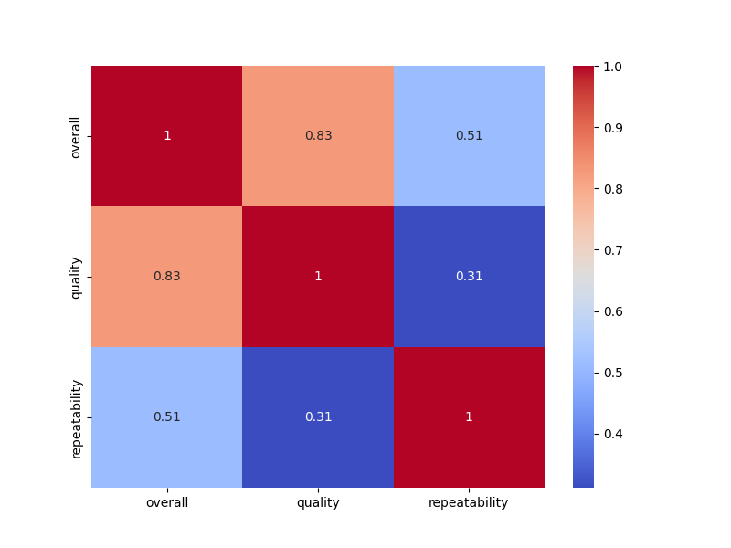
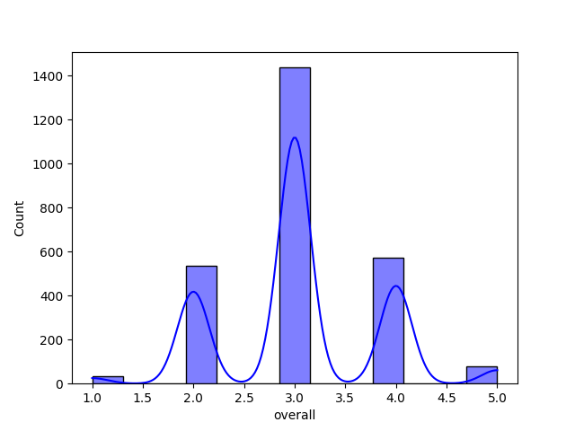
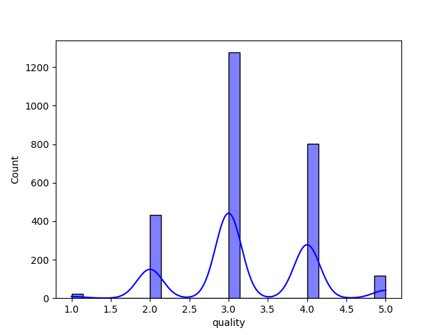
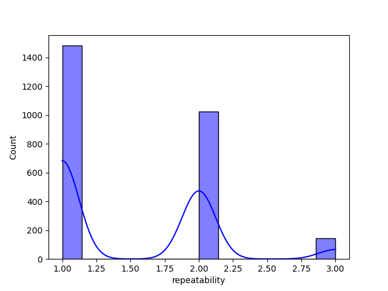

### Story of Media Dataset Analysis

In the pursuit of understanding the dynamic world of media releases, we embarked on an insightful journey through a dataset titled **media.csv**. This comprehensive dataset comprised various attributes including `date`, `language`, `type`, `title`, `by`, `overall`, `quality`, and `repeatability`. Our goal was to unveil trends, correlations, and insights that could enrich our understanding of how different media is perceived across various dimensions.

#### Time Series Analysis of Media Releases

Our exploration began with a **time series analysis** of media releases. By parsing the `date` column into proper datetime format, we crafted a line graph that illuminated the **monthly and yearly trends** in media releases. The visualization revealed distinct seasonal trends; for instance, peaks were observed during certain months, indicating popular release times, likely strategized to coincide with holidays or events. 

#### Language Distribution of Media Releases

Next, we delved into the **language distribution** of the dataset. A bar chart emerged, vividly portraying the count of media releases across a wide range of languages. It became clear that a few languages dominated the landscape, hinting at broader market reach and potential viewer engagement in those linguistic communities.

#### Overall Ratings Analysis

Understanding the value of media through its ratings led us to an analysis of the `overall` ratings. A histogram illustrated the distribution of these ratings, revealing a skew towards higher ratings but also exposing some outliers. This indicated that while most media received favorable reviews, a few dip into the lower echelons of ratings, warranting further exploration into what might influence viewer perceptions.

#### Quality vs. Repeatability Analysis

Turning our focus to the interplay between quality and repeatability, we employed a **scatter plot** to convey the relationship between these two variables. Points densely clustered along a diagonal suggested a positive correlation: higher quality ratings often aligned with increased repeatability. This insight allowed us to infer that audiences are inclined to rewatch media that maintains a high-quality standard.

#### Top Contributors to Media

As we sought to identify key players within the dataset, we analyzed the `by` column. A bar chart depicting the average overall ratings by contributor unveiled prominent figures in the media landscape. A handful of contributors not only produced a greater number of titles but also consistently received high ratings from audiences, marking them as influential in shaping viewer preferences.

#### Media Type Analysis

The diversity of media types within the dataset prompted us to create a **pie chart** that showcased the proportion of each type. This visual segmentation highlighted that certain types, possibly documentaries or feature films, constituted most of the dataset, inviting questions about how genre influences ratings and viewer engagement.

#### Quality Ratings Over Time

Charting the progression of quality ratings over time, we generated a **line graph** that depicted the average quality ratings across the years. Intriguingly, this analysis showcased a rising trend, suggesting that the media industry has been improving its production quality, possibly through advancements in technology and storytelling techniques.

#### Examining Missing Data Impact

Addressing the 262 missing records in the `by` column brought deeper insight into the dataset's reliability. By comparing average ratings of media with and without contributor information, we utilized a bar chart to visualize how these discrepancies might influence overall and quality ratings. The results were telling—media without contributor data tended to receive lower average ratings, raising questions about the importance of attribution in audience perception.

#### Comparative Analysis of Languages

Lastly, we undertook a **comparative analysis of languages**, employing grouped box plots to compare overall and quality ratings across various languages. This visualization revealed patterns that indicated some languages consistently produced better-rated media than others, harkening to cultural narratives or local cinematic expertise that resonate well with audiences.

### Conclusion

Throughout this analytical journey, the **media dataset revealed a tapestry of stories** woven through trends in releases, cultural diversity in languages, and the significant impact of quality on audience engagement. The visualizations not only supported our findings but also made the intricate relationships within the data more accessible and compelling.

Taking these insights further could propel industry stakeholders to make informed decisions on media production, distribution strategies, and enhancing viewer experiences. The landscape of media is vast and ever-evolving, but with robust analyses like this, we can continue to navigate it effectively, uncovering the narratives behind each release.

